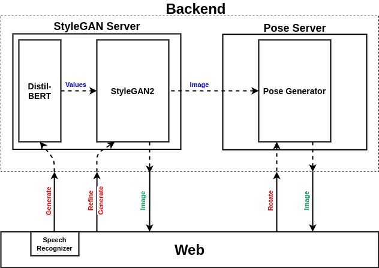

<div align=center></div>

--------------------------------------------------------------------------------

[](http://perso.crans.org/besson/LICENSE.html)

Retratista is a web-based application that enables the user to generate and manipulate a realistic human face from bare description.

For further details about our experimentation, refer to [portrait-synthesis-from-speech](https://github.com/DarkGeekMS/portrait-synthesis-from-speech).

## System Workflow

<div align=center></div>

<div align="center">
Figure(1): Complete block diagram showing the whole system design and flow between different modules.
</div><br>

## Application Design

<div align=center></div>

<div align="center">
Figure(2): Web application design.
</div><br>

## Usage

### Docker

-   Make sure you installed :
    -   Nvidia CUDA 11.1 + CUDNN8
    -   Docker CE.
    -   Docker Compose.
    -   [Nvidia Docker V2](https://github.com/NVIDIA/nvidia-docker)

-   Start application server using __docker-compose__ :
    ```bash
    bash scripts/docker_run.sh base # to run stylegan2 server with ui
    bash scripts/docker_run.sh pose # to run pose server only
    bash scripts/docker_run.sh      # to run both servers with ui
    ```

### Native

-   Make sure you installed :
    -   Nvidia CUDA 11.1 + CUDNN8
    -   python3 + python3-pip (Anaconda can be used as well).

-   Install python dependencies :
    ```bash
    pip3 install -r requirements.txt
    ```

-   Download model weights :
    ```bash
    bash scripts/download_weights_gen.sh # to download weights for stylegan2 server
    bash scripts/download_weights_rot.sh # to download weights for pose server
    ```

-   Run application stylegan2 server (port 5000) :
    ```bash
    python3 run_generator.py production 5000 # production mode
    python3 run_generator.py development 5000 # debug mode
    ```

-   Run application pose server (port 5001) :
    ```bash
    python3 run_rotator.py production 5001 # production mode
    python3 run_rotator.py development 5001 # debug mode
    ```

-   Build and run application ui (port 8080) :
    ```bash
    cd ui
    bash setup_ui.sh
    npm run style # only stylegan2 server
    # OR
    npm run styleRR # both stylegan2 and pose server
    ```
